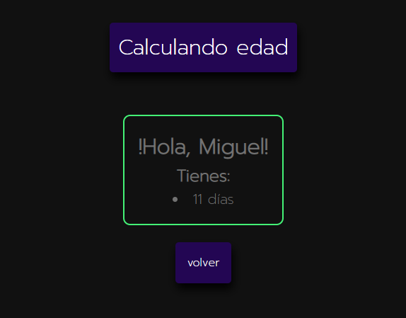

# Desarrollo web en entorno servidor

## CONTENIDOS

1. [Introducción](#introduccion)
2. [Herramientas](#herramientas)
3. [Estado de los ejercicios](#estado)
4. [Ejercicios con``SERVLET``](#servlet)
5. [Ejercicios con ``JSP``]( #jsp)
6. [Recursos](#recursos)

# Introducción

En este repositorio vamos a ir acumulando todos los **ejercicios** que realizamos sobre **``SERVLETS`` y ``JSP``**. 

En la medida de lo posible, se tratará de ofrecer con cada ejercicio no solamente su solución, sino un apartado de **observaciones** en el que describir aquellos **fragmentos de código más significativos**.

Del mismo modo, se tratará de construir tres apartados extra: 

- ``Notas`` : Recoge ordenadamente las direcciones a páginas ``html`` en las que se expondrán los **aspectos más importantes del repositorio**.
- ``Información``: Ventana flotante que muestra un **esquema del sitio web** y explica como moverse en él.
- ``Buscador``: Funcionalidad que nos permitirá **encontrar ejercicios** que contienen elementos relacionados.

Los ejercicios pueden presentar 4 estados:

-  Existe algún **error** grave (o errores) que debo corregir.
-  Después de haber sido **realizados y revisados** en clase, alcanzan este estado si no existe nada que deba cambiar en ellos.
-  Presentan **irregularidades** en el estilo o el código implementado.
-  Cuando estén **pendientes de la corrección**  en clase.

# Herramientas

   

# Estado de los ejercicios

| SERVLET                            | ESTADO                                                       | JSP                                 | ESTADO                                                       |
| ---------------------------------- | ------------------------------------------------------------ | ----------------------------------- | ------------------------------------------------------------ |
| 1. Hola Mundo                      |  | 1. Saludo                           |  |
| 2. Ciclo de vida de u              |  | 2. Edad de una                      |  |
| 3. Formulario Simple               |  | 3. Calculadora básica               |  |
| 4. Formulario Complejo             |  | 4. Monedero                         |                                                              |
| 5. Reservas                        |                                                              | 5. Mi nombre con cookies            |                                                              |
| 6. Registro                        |                                                              | 6. Operaciones básicas con sesiones |  |
| 7. Cabeceras de petición           |  | 7. Contador de visitas con sesiones |  |
| 8. Información del cliente         |                                                              | 8. Proceso de identificación        |                                                              |
| 9. Configurando los Servlets       |                                                              | 9. Carrito de la compra             |                                                              |
| 10. Gestión declarativa de errores |                                                              |                                     |                                                              |
| 11. Leer fichero                   |                                                              |                                     |                                                              |

# Ejercicios para ``SERVLETS``

## Ciclo de vida de un Servlet

- **Archivos**: ``cicloDeVida.html`` y ``CicloDeVida.java``.
- **Funcionalidad**: Programa que emite por consola un mensaje distinto según el estado de un ``servlet``.

- **Finalidad**: Añadir un mensaje distinto de tipo ``System.out``  a cada uno de estos métodos: ``init(ServletConfig config);`` ,  ``service(ServletRequest request, ServletResponse response);`` y `` destroy()``. De este modo, al inicializar nuestro Servlet desde el archivo ``.html``, si observamos la consola podemos ver como cambia aparece un mensaje según el estado: inicializado por primera vez (``init``), inicializado más de una vez (``service``), finalizado (``destroy``).

## Formulario simple

- **Archivos**: ``informacionMetodo.html``, ``Informacion.java`` y ``MetodoEnvio.java``.
- **Funcionalidad:** Programa que gestiona distintos tipos de peticiones y toma valores contextuales.
- **Finalidad:** Pasar parámetros mediante ``href`` y ``method:post`` a nuestro ``servlet``. Este hecho determina que para el manejo de nuestros datos debamos usar convenientemente los métodos ``doGet()`` y ``doPost()``. 

## Formulario Complejo

- **Archivos**:
- **Funcionalidad**:
- **Finalidad**:

## Reservas

- **Archivos**:
- **Funcionalidad**:
- **Finalidad**:

## Registro

- **Archivos**:
- **Funcionalidad**:
- **Finalidad**:

## Cabeceras de petición

- **Archivos**:
- **Funcionalidad**:
- **Finalidad**:

## Información del cliente

- **Archivos**:
- **Funcionalidad**:
- **Finalidad**:

## Configurando los Servlets 

- **Archivos**:
- **Funcionalidad**:
- **Finalidad**:

## Gestión declarativa de errores

- **Archivos**:
- **Funcionalidad**:
- **Finalidad**:

##  Leer fichero

- **Archivos**:
- **Funcionalidad**:
- **Finalidad**:

# Ejercicios para ``JSP``

## Saludo

- **Archivos**:
- **Funcionalidad**:
- **Finalidad**:

## Edad de una persona

- **Archivos**:
- **Funcionalidad**:
- **Finalidad**:

## Calculadora básica

- **Archivos**:
- **Funcionalidad**:
- **Finalidad**:

## Monedero

- **Archivos**:
- **Funcionalidad**:
- **Finalidad**:

## Mi nombre con cookies

- **Archivos**:
- **Funcionalidad**:
- **Finalidad**:

## Operaciones básicas con...

- **Archivos**:
- **Funcionalidad**:
- **Finalidad**:

## Contador de visitas con...

- **Archivos**:
- **Funcionalidad**:
- **Finalidad**:

## Proceso de identificación

- **Archivos**:
- **Funcionalidad**:
- **Finalidad**:

## Carrito de la compra

- **Archivos**:
- **Funcionalidad**:
- **Finalidad**:

# RECURSOS

- Para implementar ``README.md``:[towardsdatascience](https://towardsdatascience.com/build-a-stunning-readme-for-your-github-profile-9b80434fe5d7)

- Para poner iconos: [simpleicons](https://simpleicons.org/?q=netbea)

