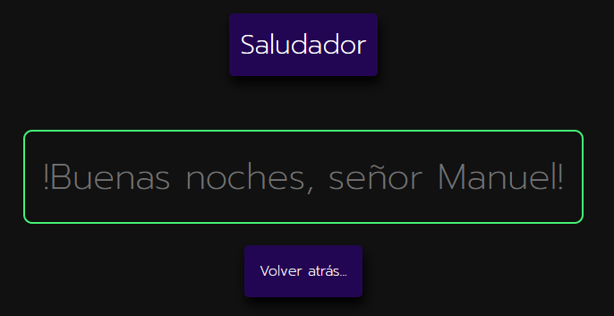

# DWES

  

## SERVLETS + JSP

#### En este repositorio vamos a ir acumulando todos los ejercicios que realizamos sobre ``SERVLETS`` y ``JSP``.

## ÍNDICE

### 1. Estado de los ejercicios

### 2. Ejercicios para ``SERVLETS``

### 3. Ejercicios para ``JSP``

## 1. Estado de los ejercicios

| SERVLETS                           | HECHO              | JSP                           | HECHO              |
| ---------------------------------- | ------------------ | ----------------------------- | ------------------ |
| 1. Hola Mundo                      | :heavy_check_mark:  | 1. Saludo                     | :heavy_check_mark:  |
| 2. Ciclo de vida de un Servlet.    | :heavy_check_mark:  | 2. Edad de una persona        | :heavy_check_mark:  |
| 3. Formulario Simple               | :heavy_check_mark:  | 3. Calculadora básica         | :heavy_check_mark:  |
| 4. Formulario Complejo             | :heavy_check_mark:  | 4. Monedero                   |                    |
| 5. Reservas                        |                    | 5. Mi nombre con cookies      |                    |
| 6. Registro                        |                    | 6. Operaciones básicas con... |                    |
| 7. Cabeceras de petición           | :heavy_check_mark:  | 7. Contador de visitas con... |                    |
| 8. Información del cliente         |                    | 8. Proceso de identificación  |                    |
| 9. Configurando los Servlets       |                    | 9. Carrito de la compra       |                    |
| 10. Gestión declarativa de errores |                    |                               |                    |
| 11. Leer fichero                   |                    |                               |                    |

## 2. Ejercicios para ``SERVLETS``

### Ciclo de vida de un Servlet

- **Archivos**: ``cicloDeVida.html`` y ``CicloDeVida.java``.
- **Funcionalidad**: Programa que emite por consola un mensaje distinto según el estado de un ``servlet``.

- **Finalidad**: Añadir un mensaje distinto de tipo ``System.out``  a cada uno de estos métodos: ``init(ServletConfig config);`` ,  ``service(ServletRequest request, ServletResponse response);`` y `` destroy()``. De este modo, al inicializar nuestro Servlet desde el archivo ``.html``, si observamos la consola podemos ver como cambia aparece un mensaje según el estado: inicializado por primera vez (``init``), inicializado más de una vez (``service``), finalizado (``destroy``).

### 

### Formulario simple

- **Archivos**: ``informacionMetodo.html``, ``Informacion.java`` y ``MetodoEnvio.java``.
- **Funcionalidad:** Programa que gestiona distintos tipos de peticiones y toma valores contextuales.

- **Finalidad:** Pasar parámetros mediante ``href`` y ``method:post`` a nuestro ``servlet``. Este hecho determina que para el manejo de nuestros datos debamos usar convenientemente los métodos ``doGet()`` y ``doPost()``. 

### Formulario Complejo

- **Archivos**:
- **Funcionalidad**:
- **Finalidad**:

### Reservas

- **Archivos**:
- **Funcionalidad**:
- **Finalidad**:

### Registro

- **Archivos**:
- **Funcionalidad**:
- **Finalidad**:

### Cabeceras de petición

- **Archivos**:
- **Funcionalidad**:
- **Finalidad**:

### Información del cliente

- **Archivos**:
- **Funcionalidad**:
- **Finalidad**:

### Configurando los Servlets 

- **Archivos**:
- **Funcionalidad**:
- **Finalidad**:

### Gestión declarativa de errores

- **Archivos**:
- **Funcionalidad**:
- **Finalidad**:

###  Leer fichero

- **Archivos**:
- **Funcionalidad**:
- **Finalidad**:

## 3. Ejercicios para ``JSP``

### Saludo

- **Archivos**:
- **Funcionalidad**:
- **Finalidad**:

### Edad de una persona

- **Archivos**:
- **Funcionalidad**:
- **Finalidad**:

### Calculadora básica

- **Archivos**:
- **Funcionalidad**:
- **Finalidad**:

### Monedero

- **Archivos**:
- **Funcionalidad**:
- **Finalidad**:

### Mi nombre con cookies

- **Archivos**:
- **Funcionalidad**:
- **Finalidad**:

### Operaciones básicas con...

- **Archivos**:
- **Funcionalidad**:
- **Finalidad**:

### Contador de visitas con...

- **Archivos**:
- **Funcionalidad**:
- **Finalidad**:

### Proceso de identificación

- **Archivos**:
- **Funcionalidad**:
- **Finalidad**:

### Carrito de la compra

- **Archivos**:
- **Funcionalidad**:
- **Finalidad**:

[Debo mirar](https://towardsdatascience.com/build-a-stunning-readme-for-your-github-profile-9b80434fe5d7)
